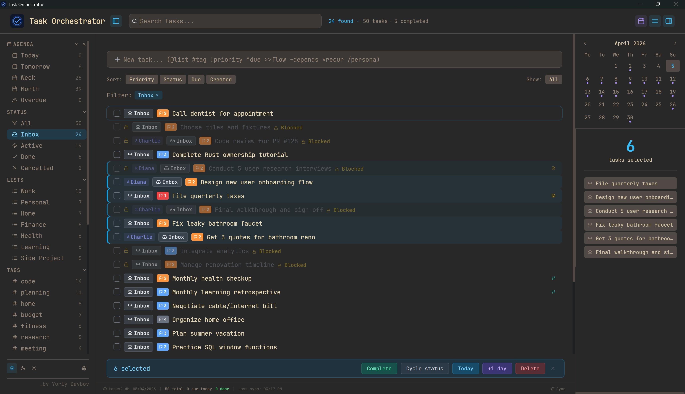
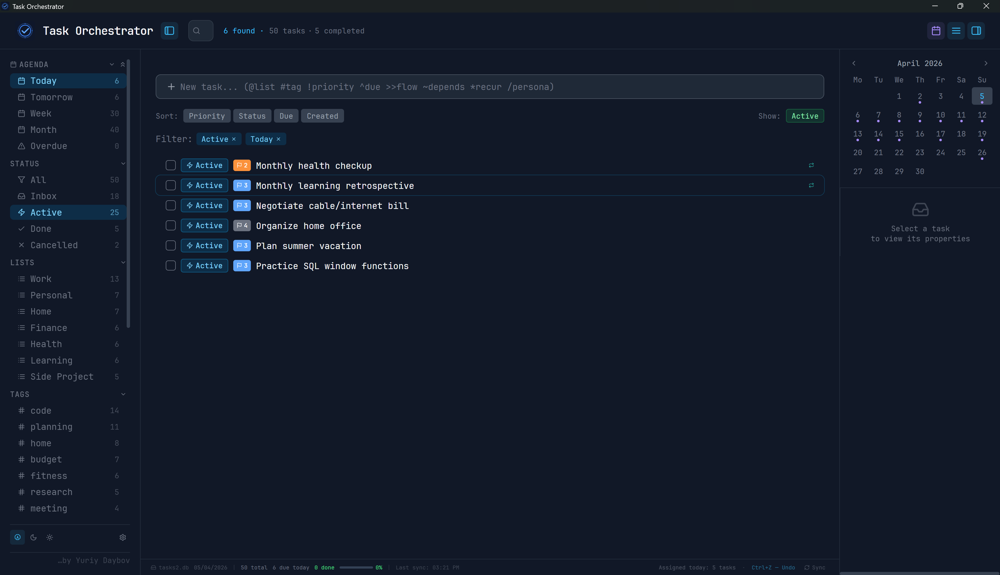
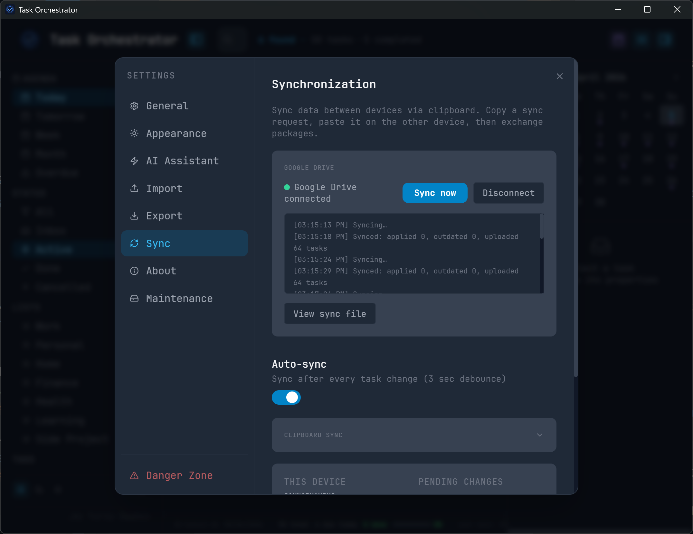

# Task Orchestrator

A fast, lightweight desktop task manager that keeps your data where it belongs — on your machine.

No cloud. No account. No telemetry. Just a single SQLite file you fully control.

[Русская версия](README.ru.md)



## Why Task Orchestrator

**Your data is a file.** Tasks are stored in a single `.db` file on your disk. Back it up by copying. Move it to another machine by dragging. Open it with any SQLite viewer to inspect or export. No vendor lock-in, no subscription, no server dependency.

**Lightweight.** ~5 MB installer. Starts instantly. Uses minimal RAM. Built with Tauri — native performance without Electron overhead.

**Keyboard-first.** Create tasks, navigate, bulk-edit, change priorities — all without touching the mouse. Or use the mouse if you prefer. Both work.

**Offline by design.** Works without internet. Always. Your tasks are never sent anywhere.

## Screenshots

| Main window | Settings |
|:-----------:|:--------:|
|  |  |

## Features

### Quick Entry
Create tasks with shorthand tokens — type everything in one line:

`@list` `#tag` `!1`-`!4` priority `^due` `>>flow` `~depends` `*recur` `/persona`

Supports natural language dates: `^today`, `^tomorrow`, `^+3d`, `^+1w`, `^+2m`

### Keyboard Navigation

| Key | Action |
|-----|--------|
| `Up` / `Down` | Move cursor |
| `Shift+Up/Down` | Extend selection |
| `Home` / `End` | Jump to first / last task |
| `Ctrl+Shift+A` | Select all |
| `Space` | Mark done / reopen |
| `S` | Cycle status |
| `E` | Edit selected task |
| `Del` | Delete |
| `1`-`4` | Set priority |
| `Shift+P` | Postpone +1 day |
| `Ctrl+Z` | Undo |
| `Ctrl+N` | Focus Quick Entry |
| `Ctrl+E` | Focus search bar |
| `Ctrl+O` | Open another database |
| `Esc` | Clear selection / search / filters |

### Organization
- **Statuses** — Inbox, Active, Done, Cancelled with cycle and direct set
- **Priorities** — 4 levels with color coding
- **Lists** — group tasks by project or area
- **Tags** — flexible labeling
- **Personas** — assign tasks to people
- **Task Flows** — dependency chains with progress tracking, auto-activation, and blocking
- **Recurring tasks** — daily, weekly, monthly, yearly with auto-spawn on completion

### Views & Filters
- Sidebar filters by status, list, tags, flow, persona, date range
- Calendar panel with task-dot indicators and date range highlighting
- Completion filter toggle (All / Active / Done)
- Search with automatic keyboard layout detection (EN/RU)
- Sort by priority, status, due date, or creation date — secondary sort always by title

### Data & Storage
- Single SQLite file — portable, inspectable, easy to back up
- Manual backup from Settings with one click
- Automatic backup before database migrations
- WAL mode for reliability — no data loss on crash
- Export and import via standard SQLite tools

### Interface
- Dark and light themes with color schemes
- English and Russian interface
- Interactive onboarding guide
- Status bar with daily progress
- Compact and comfortable display modes
- Context menu with status submenu and bulk actions

## Mobile PWA

A ready-to-use PWA is available at **https://daybov.com/to/**

This is simply a convenient way to install the app on your mobile device. It is **not** server-side storage — all your data is stored locally in your browser's IndexedDB. The hosted version is identical to what you'd get by building the PWA yourself.

### Install on mobile

- **Android (Chrome):** Open the URL → Menu (three dots) → **Install**
- **iOS (Safari only):** Open the URL → Share → **Add to Home Screen** → enable "Open as Web App"

> Chrome on iOS cannot install PWAs — use Safari.

### Self-hosting the PWA

You can build and host the PWA anywhere:

```bash
cd pwa
npm install
npm run build
```

The `pwa/dist/` folder contains static files ready for any hosting (Vercel, Netlify, Nginx, etc.). See [Self-hosting guide](#self-hosting-details) below for subdirectory deployment.

## Google Drive Sync

Optional cross-device sync using your own Google Drive account. No third-party servers — tokens stay on your device.

- Auto-sync after every change (configurable)
- Manual sync via status bar button
- Works on both desktop and PWA

**Setup guide:** [GOOGLE_DRIVE_SETUP.md](GOOGLE_DRIVE_SETUP.md) (English + Russian)

## Installation

Download the latest installer from [Releases](../../releases).

### Windows SmartScreen

On first launch Windows may show a "Windows protected your PC" dialog — the app is not code-signed.

1. Click **More info**
2. Click **Run anyway**

This appears only once.

## Building from source

```bash
# Desktop — requires Node.js 18+, Rust, Tauri CLI
cd tauri-app
npm install
npm run tauri build

# PWA
cd pwa
npm install
npm run build
```

The desktop installer will be in `tauri-app/src-tauri/target/release/bundle/`.

## Tests

```bash
# Desktop (140 tests)
cd tauri-app && npx vitest run

# PWA (32 tests)
cd pwa && npx vitest run
```

## Tech stack

- **Tauri 2** — lightweight native shell (~5 MB vs ~150 MB Electron)
- **React 18** — UI in a single component file
- **SQLite** — local database via `@tauri-apps/plugin-sql`, WAL mode (desktop)
- **IndexedDB** — local storage (PWA)
- **Google Drive API** — optional sync via `drive.appdata` scope
- **Tailwind CSS** — utility-first styling
- **lucide-react** — icon set

## Self-hosting details

If deploying the PWA to a subdirectory (e.g. `/app/`), update `base` in `pwa/vite.config.js`:

```js
base: command === 'build' ? '/app/' : '/',
```

Also update `SHELL_URLS` in `pwa/public/sw.js` and the service worker registration path in `pwa/src/main.jsx`.

When configuring Google Drive sync for a self-hosted PWA, add your URL as an Authorized redirect URI in Google Cloud Console (see [setup guide](GOOGLE_DRIVE_SETUP.md)).

## License

MIT
