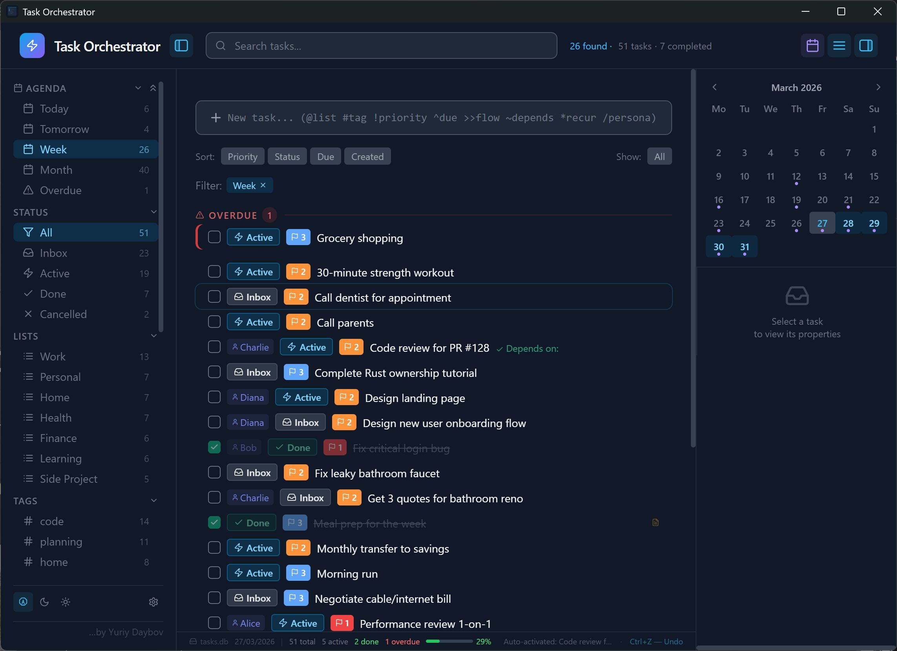
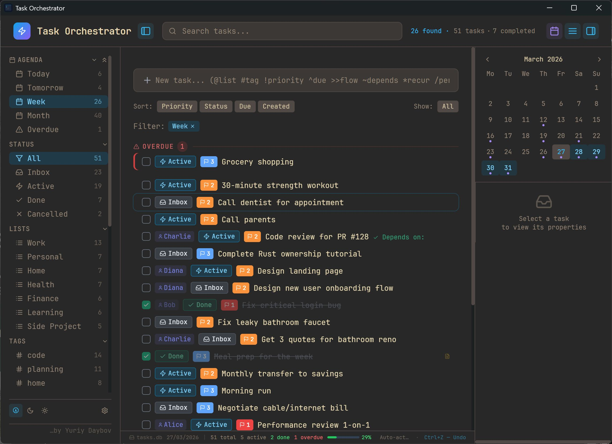
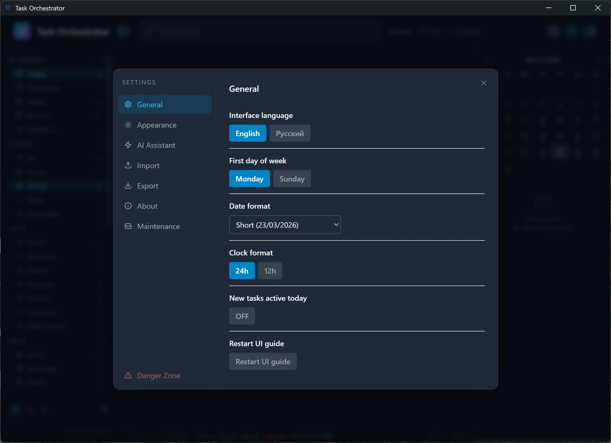

# Task Orchestrator

Быстрый и легковесный десктопный менеджер задач, который хранит ваши данные там, где им место — на вашем компьютере.

Без облака. Без регистрации. Без телеметрии. Один файл SQLite под вашим полным контролем.

[English version](README.md)



## Почему Task Orchestrator

**Ваши данные — это файл.** Задачи хранятся в одном файле `.db` на вашем диске. Резервная копия — просто копирование файла. Перенос на другой компьютер — перетащить файл. Просмотр — открыть любым SQLite-просмотрщиком. Никакой привязки к сервису, подписки или зависимости от сервера.

**Легковесность.** Установщик ~5 МБ. Запускается мгновенно. Минимальное потребление памяти. Построен на Tauri — нативная производительность без тяжести Electron.

**Клавиатура в приоритете.** Создание задач, навигация, массовое редактирование, смена приоритетов — всё без мыши. Или мышью, если удобнее. Работает и так, и так.

**Офлайн по дизайну.** Работает без интернета. Всегда. Ваши задачи никуда не отправляются.

## Скриншоты

| Главное окно | Настройки |
|:------------:|:---------:|
|  |  |

## Возможности

### Быстрый ввод
Создавайте задачи одной строкой с помощью токенов:

`@список` `#тег` `!1`-`!4` приоритет `^дедлайн` `>>flow` `~зависимость` `*повтор` `/персона`

Поддержка дат на естественном языке: `^сегодня`, `^завтра`, `^+3d`, `^+1w`, `^+2m`

### Горячие клавиши

| Клавиша | Действие |
|---------|----------|
| `Вверх` / `Вниз` | Перемещение курсора |
| `Shift+Вверх/Вниз` | Расширение выделения |
| `Ctrl+Shift+A` | Выделить все |
| `Пробел` | Завершить / возобновить |
| `S` | Цикл статусов |
| `Del` | Удалить |
| `1`-`4` | Установить приоритет |
| `Shift+P` | Отложить на +1 день |
| `Ctrl+Z` | Отменить |
| `Ctrl+N` | Фокус на ввод задачи |
| `Esc` | Сбросить выделение / поиск / фильтры |

### Организация
- **Статусы** — Входящие, Активные, Готово, Отменено — с переключением и прямой установкой
- **Приоритеты** — 4 уровня с цветовой индикацией
- **Списки** — группировка по проектам или направлениям
- **Теги** — гибкая маркировка
- **Персоны** — назначение задач людям
- **Task Flows** — цепочки зависимостей с прогрессом, автоактивацией и блокировкой
- **Повторяющиеся задачи** — ежедневно, еженедельно, ежемесячно, ежегодно с автосозданием при завершении

### Просмотр и фильтрация
- Фильтры в боковой панели по статусу, списку, тегам, flow, персоне, периоду
- Календарь с точками задач и подсветкой выбранного периода
- Переключатель Все / Активные / Завершённые
- Поиск с автоматическим определением раскладки клавиатуры (EN/RU)
- Сортировка по приоритету, статусу, дедлайну или дате создания

### Данные и хранение
- Один файл SQLite — переносимый, просматриваемый, легко копируемый
- Ручной бэкап из Настроек одним кликом
- Автоматический бэкап перед миграциями базы данных
- Режим WAL для надёжности — нет потери данных при сбое
- Экспорт и импорт стандартными инструментами SQLite

### Интерфейс
- Тёмная и светлая темы с цветовыми схемами
- Английский и русский интерфейс
- Интерактивное руководство при первом запуске
- Статусная строка с прогрессом за день
- Компактный и комфортный режимы отображения
- Контекстное меню с подменю статуса и массовыми действиями

## Установка

Скачайте установщик из [Releases](../../releases).

### Windows SmartScreen

При первом запуске Windows может показать предупреждение — приложение не имеет цифровой подписи.

1. Нажмите **Подробнее**
2. Нажмите **Выполнить в любом случае**

Предупреждение появляется только один раз. Приложение не подключается к интернету.

## Сборка из исходников

```bash
# Требуется: Node.js 18+, Rust, Tauri CLI
cd tauri-app
npm install
npm run tauri build
```

Установщик будет в `tauri-app/src-tauri/target/release/bundle/`.

## Тесты

```bash
cd tauri-app
npm test
```

44 теста: консистентность схемы, генерация ULID, валидация дат, поведение транзакций SQLite.

## Технологии

- **Tauri 2** — легковесная нативная оболочка (~5 МБ против ~150 МБ Electron)
- **React 18** — UI в едином файле компонента
- **SQLite** — локальная БД через `@tauri-apps/plugin-sql`, режим WAL
- **Tailwind CSS** — утилитарная стилизация
- **lucide-react** — набор иконок

## Планы развития

- Клиент для macOS
- Клиенты для iOS и Android
- Синхронизация между устройствами

## Лицензия

MIT
