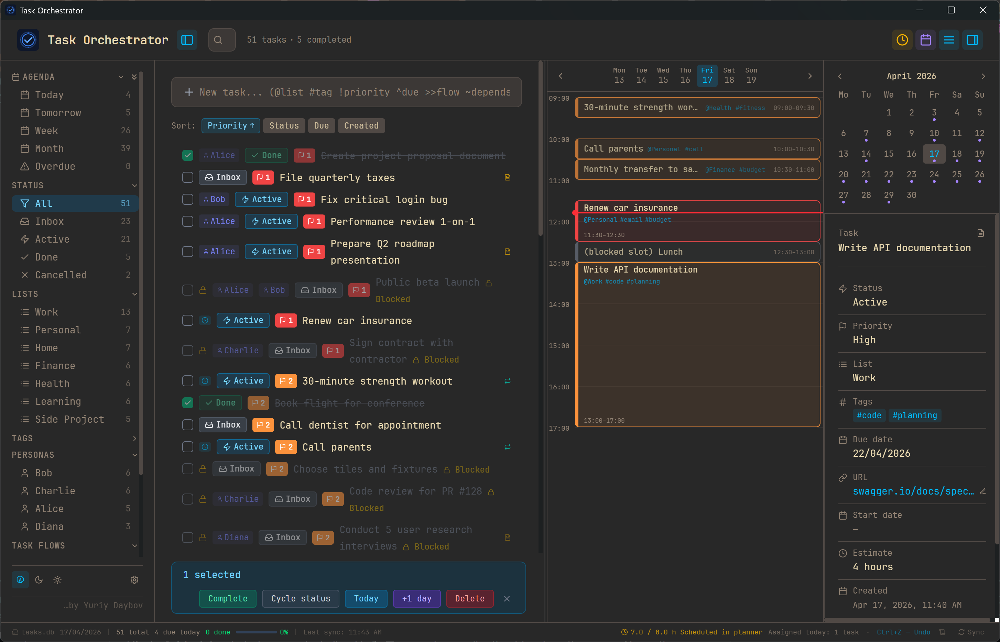
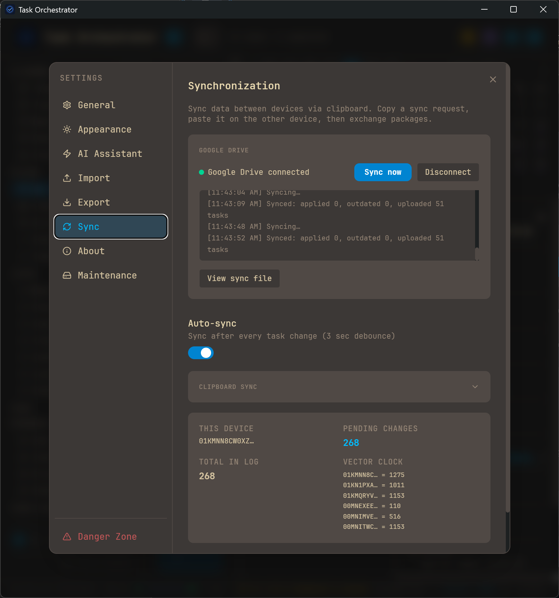

# Task Orchestrator

Быстрый и легковесный десктопный менеджер задач, который хранит ваши данные там, где им место — на вашем компьютере.

Без облака. Без регистрации. Без телеметрии. Один файл SQLite под вашим полным контролем.

[English version](README.md)



## Почему Task Orchestrator

**Ваши данные — это файл.** Задачи хранятся в одном файле `.db` на вашем диске. Резервная копия — просто копирование файла. Перенос на другой компьютер — перетащить файл. Просмотр — открыть любым SQLite-просмотрщиком. Никакой привязки к сервису, подписки или зависимости от сервера.

**Легковесность.** Установщик ~5 МБ. Запускается мгновенно. Минимальное потребление памяти. Построен на Tauri — нативная производительность без тяжести Electron.

**Клавиатура в приоритете.** Создание задач, навигация, массовое редактирование, смена приоритетов — всё без мыши. Или мышью, если удобнее. Работает и так, и так.

**Офлайн по дизайну.** Работает без интернета. Всегда. Ваши задачи никуда не отправляются.

## Скриншоты



## Возможности

### Быстрый ввод
Создавайте задачи одной строкой с помощью токенов:

`@список` `#тег` `!1`-`!4` приоритет `^дедлайн` `>>flow` `~зависимость` `*повтор` `/персона`

Умное распознавание дат с предпросмотром:
- Ключевые слова: `^сегодня`, `^завтра`, `^вчера`
- День недели: `^пн`, `^понедельник`, `^mon`, `^friday`
- Относительные: `^+3d`, `^+2w`, `^+1m`
- Число месяца: `^20` (20-е текущего/следующего месяца)
- День.Месяц: `^20.04`, `^25/12`
- Месяц словом: `^5янв`, `^15авг`, `^5jan`

### Горячие клавиши

| Клавиша | Действие |
|---------|----------|
| `Вверх` / `Вниз` | Перемещение курсора |
| `Shift+Вверх/Вниз` | Расширение выделения |
| `Home` / `End` | Перейти к первой / последней задаче |
| `Ctrl+Shift+A` | Выделить все |
| `Пробел` | Завершить / возобновить |
| `S` | Цикл статусов |
| `Enter` | Редактировать задачу |
| `F2` | Переименовать на месте |
| `Del` | Удалить |
| `1`-`4` | Установить приоритет |
| `Shift+P` | Отложить на +1 день |
| `Ctrl+Z` | Отменить |
| `Ctrl+N` | Фокус на ввод задачи |
| `Ctrl+E` | Фокус на поиск |
| `Ctrl+O` | Открыть другую базу данных |
| `Esc` | Сбросить выделение / поиск / фильтры |

### Организация
- **Статусы** — Входящие, Активные, Готово, Отменено — с переключением и прямой установкой
- **Приоритеты** — 4 уровня с цветовой индикацией
- **Списки** — группировка по проектам или направлениям
- **Теги** — гибкая маркировка
- **Персоны** — назначение задач людям
- **Task Flows** — цепочки зависимостей с прогрессом, автоактивацией и блокировкой
- **Повторяющиеся задачи** — ежедневно, еженедельно, ежемесячно, ежегодно с автосозданием при завершении

### Планировщик дня
- Перетаскивайте задачи в временные слоты для планирования дня
- Изменяемые по размеру и перемещаемые блоки времени
- Блокировка времени для нерабочих активностей
- Навигация по неделям с подсветкой сегодняшнего дня

### Просмотр и фильтрация
- Фильтры в боковой панели по статусу, списку, тегам, flow, персоне, периоду
- Календарь с точками задач и подсветкой выбранного периода
- Переключатель Все / Активные / Завершённые
- Поиск с автоматическим определением раскладки клавиатуры (EN/RU)
- Сортировка по приоритету, статусу, дедлайну или дате создания
- Фильтры и сортировка сохраняются между перезапусками

### Данные и хранение
- Один файл SQLite — переносимый, просматриваемый, легко копируемый
- Ручной бэкап из Настроек одним кликом
- Автоматический бэкап перед миграциями базы данных
- Режим WAL для надёжности — нет потери данных при сбое
- Экспорт и импорт стандартными инструментами SQLite

### Интерфейс
- Тёмная и светлая темы с цветовыми схемами
- Английский и русский интерфейс
- Интерактивное руководство при первом запуске
- Статусная строка с прогрессом за день
- Компактный и комфортный режимы отображения
- Контекстное меню с подменю статуса и массовыми действиями

## Мобильное PWA-приложение

Готовое PWA доступно по адресу **https://daybov.com/to/**

Это просто удобный способ установить приложение на мобильное устройство. Данные хранятся **не на сервере**, а локально в IndexedDB вашего браузера. Размещённая версия идентична той, что вы получите, собрав PWA самостоятельно.

### Установка на мобильные

- **Android (Chrome):** Откройте URL → Меню (три точки) → **Установить**
- **iOS (только Safari):** Откройте URL → Поделиться → **На экран «Домой»** → включите «Open as Web App»

> Chrome на iOS не может устанавливать PWA — используйте Safari.

### Самостоятельное размещение PWA

Вы можете собрать и разместить PWA где угодно:

```bash
cd pwa
npm install
npm run build
```

Папка `pwa/dist/` содержит статические файлы для любого хостинга (Vercel, Netlify, Nginx и т.д.). Подробности по размещению в поддиректории — см. [ниже](#детали-самостоятельного-размещения).

## Синхронизация через Google Drive

Опциональная синхронизация между устройствами через ваш аккаунт Google Drive. Без сторонних серверов — токены остаются на вашем устройстве.

- Автосинхронизация после каждого изменения (настраивается)
- Ручная синхронизация кнопкой в строке статуса
- Работает и в десктопе, и в PWA

**Инструкция по настройке:** [GOOGLE_DRIVE_SETUP.md](GOOGLE_DRIVE_SETUP.md) (English + Русский)

## Установка

Скачайте установщик из [Releases](../../releases).

### Windows SmartScreen

При первом запуске Windows может показать предупреждение — приложение не имеет цифровой подписи.

1. Нажмите **Подробнее**
2. Нажмите **Выполнить в любом случае**

Предупреждение появляется только один раз.

## Сборка из исходников

```bash
# Десктоп — требуется Node.js 18+, Rust, Tauri CLI
cd tauri-app
npm install
npm run tauri build

# PWA
cd pwa
npm install
npm run build
```

Установщик десктопа будет в `tauri-app/src-tauri/target/release/bundle/`.

## Тесты

```bash
# Десктоп
cd tauri-app && npx vitest run

# PWA
cd pwa && npx vitest run
```

## Технологии

- **Tauri 2** — легковесная нативная оболочка (~5 МБ против ~150 МБ Electron)
- **React 18** — UI в едином файле компонента
- **SQLite** — локальная БД через `@tauri-apps/plugin-sql`, режим WAL (десктоп)
- **IndexedDB** — локальное хранилище (PWA)
- **Google Drive API** — опциональная синхронизация через scope `drive.appdata`
- **Tailwind CSS** — утилитарная стилизация
- **lucide-react** — набор иконок

## Детали самостоятельного размещения

При размещении PWA в поддиректории (например `/app/`) обновите `base` в `pwa/vite.config.js`:

```js
base: command === 'build' ? '/app/' : '/',
```

Также обновите `SHELL_URLS` в `pwa/public/sw.js` и путь регистрации Service Worker в `pwa/src/main.jsx`.

При настройке синхронизации Google Drive для самостоятельно размещённой PWA добавьте ваш URL в Authorized redirect URIs в Google Cloud Console (см. [инструкцию](GOOGLE_DRIVE_SETUP.md)).

## Лицензия

MIT
